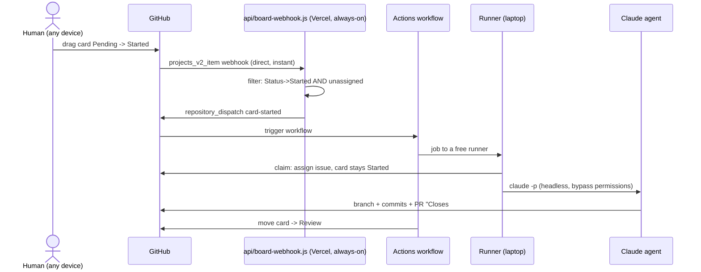

How a card drag becomes a working agent on VCP hardware — every hop is event-driven (pushed, not polled), $0/month infrastructure.

Alternate triggers into the same workflow: the `ai-build` label (native, works without the webhook) and manual `gh workflow run agent-build.yml -f issue=N`.

**Retired 2026-07-05 (issue #51):** the webhook used to route through a `smee.io` free tunnel to `relay.js` running on Jose's laptop — a chain with two independent points of failure (smee.io's best-effort delivery, and the laptop's relay process needing to be alive). Both failed at once on 2026-07-05: issues #3/#30 sat at Completed with an unmerged PR for over an hour, and even the 5-minute [[Board Integrity Sweep]] fallback didn't run, because it depends on the same self-hosted runner being online. `api/board-webhook.js` (a Vercel Function) replaces the smee.io hop entirely — GitHub calls it directly, no local machine needs to be on to *receive* the webhook. `relay.js` stays in the repo for local dev/testing only. Agent **dispatch itself** (the runner executing `claude -p`) is unaffected — still bound by the subscription-auth-only constraint in [[Worker Fleet and Scaling]].

Safety and resilience baked in:
- **One agent per ticket** — workflow concurrency group keyed on issue number
- **Unassigned-only dispatch** — the webhook receiver skips cards that are already claimed, so a human working a ticket is never trampled
- **One automatic retry** — transient API stalls don't kill unattended runs
- **Failures self-report** — a failed run comments the log link on its own ticket
- Agents work in the runner's `_work` checkout, never in a human's working copy

The code: `.github/workflows/agent-build.yml` and `api/board-webhook.js` in the repo (`agent-dispatch/relay.js` kept for local dev reference, no longer the production path). Verified end-to-end 2026-07-03 (smoke test issue #7 → PR #8); webhook receiver replaced 2026-07-05 (issue #51).
