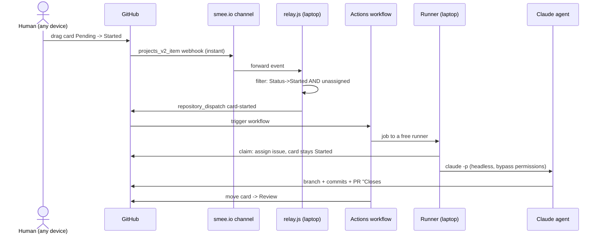

How a card drag becomes a working agent on VCP hardware — every hop is event-driven (pushed, not polled), $0/month infrastructure.

Alternate triggers into the same workflow: the `ai-build` label (native, works without the webhook) and manual `gh workflow run agent-build.yml -f issue=N`.

Safety and resilience baked in:
- **One agent per ticket** — workflow concurrency group keyed on issue number
- **Unassigned-only dispatch** — the relay skips cards that are already claimed, so a human working a ticket is never trampled
- **One automatic retry** — transient API stalls don't kill unattended runs
- **Failures self-report** — a failed run comments the log link on its own ticket
- Agents work in the runner's `_work` checkout, never in a human's working copy

The code: `.github/workflows/agent-build.yml` and `agent-dispatch/relay.js` in the repo. Verified end-to-end 2026-07-03 (smoke test issue #7 → PR #8).
