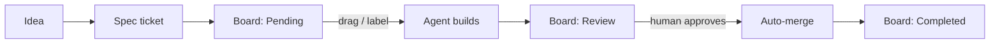

Hub for how VCP operates: the full logic flow from idea to merged code, designed so the company scales autonomously — more tickets, more agents, more workers, without more coordination overhead.

## The operating loop at a glance

Humans decide **what** to build and **whether it shipped well**. Everything between those two moments is autonomous.

## Notes in this cluster

- [[The Three Systems]] — the state/how/why split that everything sits on
- [[Ticket Lifecycle]] — the four board columns and what moves cards
- [[Agent Dispatch Pipeline]] — how a card drag becomes a working agent
- [[Review Gate]] — why agents never merge, and how approval works
- [[Worker Fleet and Scaling]] — the runners, the subscription constraint, how we grow
- [[Team Onboarding]] — how new humans join with zero setup ceremony
