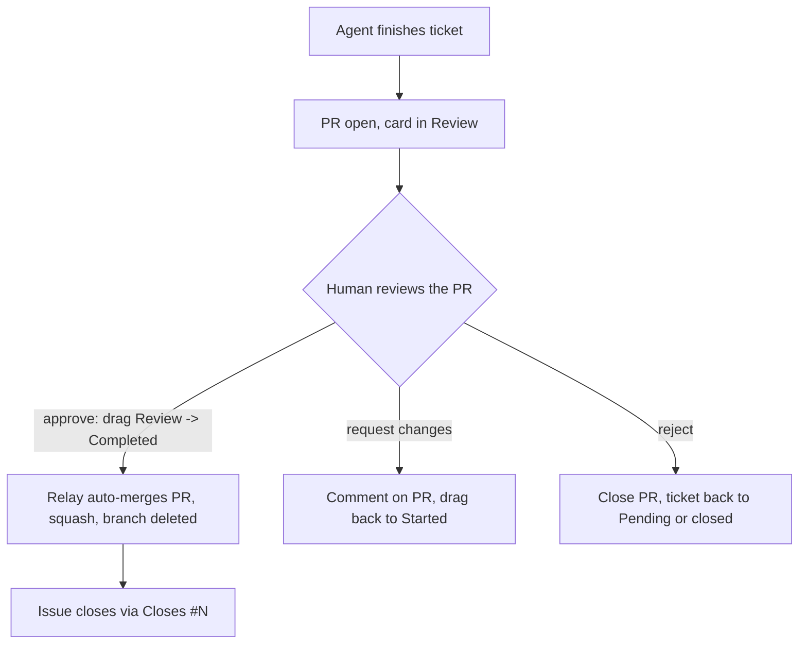

The one rule that makes autonomous scaling safe: **agents never merge**. Every agent's output stops at a PR, and a human's board drag is the act of approval.

Why the drag *is* the approval: it keeps judgment human while making the mechanics instant. The reviewer reads the PR wherever they are (phone included); the moment they drag the card, the relay finds the ticket's PR and merges it. No terminal needed to ship.

What this buys as agent count grows:
- **Quality floor** — nothing reaches `main` unseen, no matter how many agents run
- **Blast-radius control** — a bad agent run costs one rejected PR, never a broken main
- **Trust calibration** — early on, review everything; as specs and agents prove out, review gets faster but the gate never disappears

The merge-on-drag logic lives in `agent-dispatch/relay.js` (the `Review -> Completed` branch).
