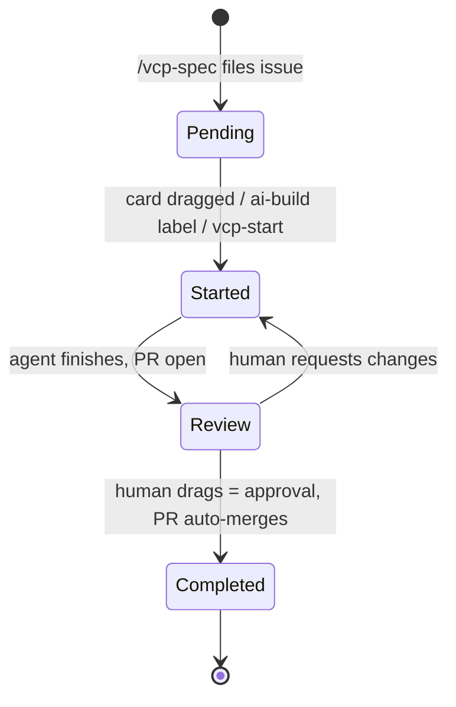

Every unit of work is a ticket moving left-to-right across four columns. Nothing gets built without a ticket; the board is never wrong about who is doing what.

| Column | Meaning | Who moves it here |
|--------|---------|-------------------|
| Pending | Spec filed, unclaimed | `/vcp-spec` (automatic) |
| Started | Agent or human working | Human drag → [[Agent Dispatch Pipeline]] fires |
| Review | PR open, awaiting judgment | Agent's workflow (automatic) |
| Completed | Approved and merged | Human drag = the approval act itself ([[Review Gate]]) |

Attribution is automatic and unfakeable: creator = issue author, completer = whoever's merged PR closed it. GitHub records both.

Tickets are born from specs written to be executed **without follow-up questions** — content models, acceptance criteria, out-of-scope, dependencies. That precision is what lets an agent (or a stranger) pick up any Pending card cold. As of 2026-07-03 the spec set is issues #1–#5 (the VCP webpage) plus #6 (this automation).
