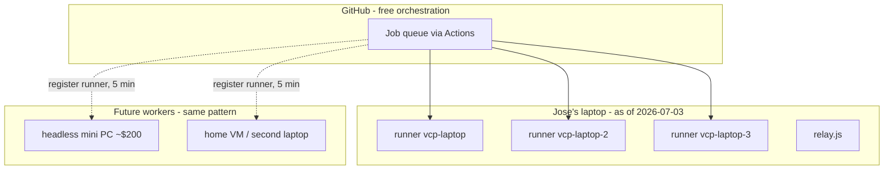

The compute layer: where agents physically run, and the constraint that shapes every scaling decision.

**The constraint:** agents authenticate with Jose's Claude **subscription login** — never per-token API billing. Intelligence cost is flat; only hardware carries the login. So the fleet grows by adding *machines with the login*, not cloud runners.

Why this is CPU-cheap: agents are **headless** — no editor, no Electron, no indexing (the Cursor trap). Claude's thinking happens in Anthropic's cloud; local CPU is spent only on builds/tests/git. Each runner idles near 0%.

Scaling rules:
- **3 runners per laptop-class machine** — the cap is parallel *builds*, not Claude
- **A 4th simultaneous ticket queues automatically** — GitHub holds it until a runner frees; nothing fails
- **New machine onboarding:** install Claude Code + gh, log in once each, register a runner against the repo, add autostart. ~15 minutes, then it serves the queue forever
- The ideal scale-out unit is a silent headless mini PC on a shelf — always on, ~10 W, carries the login where cloud runners can't

Runner setup lives in `agent-dispatch/README.md`; the machines themselves are listed there as they're added.
