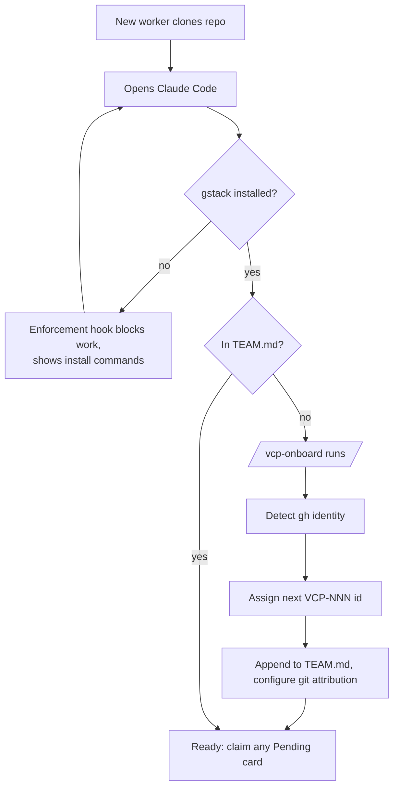

New humans join with zero ceremony: clone the repo, open Claude Code, and the system registers them. Nobody schedules an onboarding call.

The moving parts:
- **`.claude/hooks/check-gstack.sh`** — blocks skill use until gstack is installed, with the exact install commands in the error (team mode)
- **`/vcp-onboard`** — detects the terminal's GitHub identity, assigns the next sequential `VCP-NNN` member ID, registers them in `TEAM.md`, sets git attribution
- **`CLAUDE.md` session checklist** — every session checks registration first, so workers are added dynamically on first contact
- **Repo-shipped skills** (`.claude/skills/`) — `/vcp-spec`, `/vcp-start`, `/vcp-onboard` arrive with the clone; nothing to install per-person beyond gstack

Roster and IDs: `TEAM.md` at the repo root. As of 2026-07-03: VCP-001 (Jose, owner).
