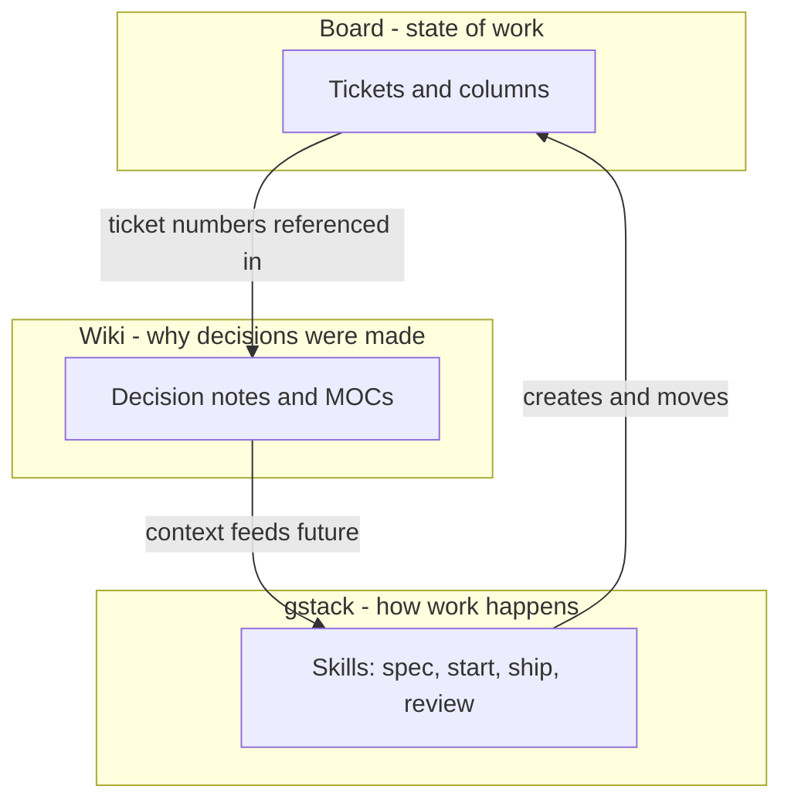

VCP runs on three systems with strictly separated jobs — mixing them is how companies lose track of themselves.

| System | Job | One question it answers |
|--------|-----|------------------------|
| GitHub Projects ([VCP Tracker](https://github.com/users/Joeareval19/projects/2)) | State of work | "What is happening right now, and who owns it?" |
| gstack + project skills | How work gets done | "What is the procedure for X?" |
| This wiki (Obsidian vault) | Why decisions were made | "Why did we do it this way?" |

The scaling property: each system absorbs growth without meetings. More work = more cards (board scales). More procedures = more skills (gstack scales). More decisions = more notes (wiki scales). A new [[Team Onboarding|worker]] reads all three and needs nobody to explain anything.
